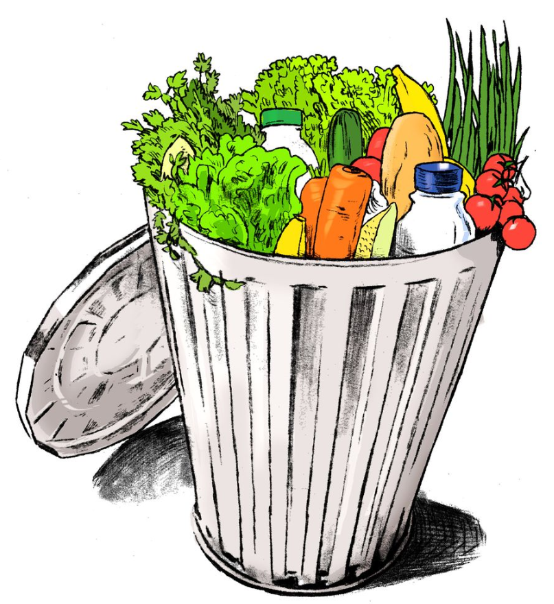
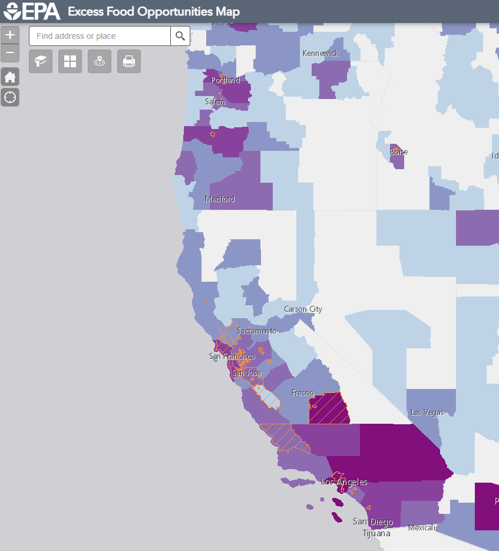

## Food Waste Background 

.center[]

---

## Describe Data

.center[]

---

## Analysis: (Low) Food Waste Estimate
```{r, echo = FALSE, warning = FALSE, message = FALSE}
#loading in libraries
library(here)
library(tidyverse)
library(janitor)
library(readxl)
library(dplyr)
library(ggplot2)

#loading food waste data on wholesale and retail 
foodRaw <- read_excel(here("data", "foodWaste", "Food_Wholesale_Retail.xlsx"), sheet = "Data") |> 
  clean_names() |> 
  mutate(excessfood_tonyear_lowest = as.numeric(excessfood_tonyear_lowest), excessfood_tonyear_highest = as.numeric(excessfood_tonyear_highest)) |> 
  filter(is.na(excessfood_tonyear_lowest) == FALSE, is.na(excessfood_tonyear_highest) == FALSE, county != "NULL")

#loading in CA county & income census data
Census <- read_excel(here("data", "census2020.xlsx"), sheet = "Data2") |> 
  clean_names()

#cleaning up foodRaw data
food <- foodRaw |> 
  select("county", "state", "excessfood_tonyear_lowest", "excessfood_tonyear_highest") |> 
  filter(state == "CA") |> 
  group_by(county) |> 
  summarise(Mean_Food_Waste_Low = mean(excessfood_tonyear_lowest), Mean_Food_Waste_High = mean(excessfood_tonyear_highest))

foodCensus <- left_join(Census, food, by = "county") |> 
  select("county",
         "mean_household_income_dollars",
         "Mean_Food_Waste_Low",
         "Mean_Food_Waste_High")

lowWastePlot <- ggplot(data = foodCensus,
                       aes(x = Mean_Food_Waste_Low,
                           y = mean_household_income_dollars)) +
  labs(x = "Food Waste Low Estimate (tons)",
      y = "Mean Household Income ($)") +
  geom_point(alpha = 0.1, size = 3) + 
  geom_smooth(method ='lm', 
              formula = y~x, 
              color ="lightcoral", 
              se = F, size = 1.5) +
  theme_classic()

lowWastePlot
```

---

## Analysis: (High) Food Waste Estimate 

```{r, echo = FALSE, eval=requireNamespace("ggplot2", quietly=TRUE)}
highWastePlot <- ggplot(data = foodCensus,
                        aes(x = Mean_Food_Waste_High,
                            y = mean_household_income_dollars)) +
  labs(x = "Food Waste Estimate - High (tons)",
      y = "Mean Household Income ($)") +
  geom_point(alpha = 0.1, size = 3) + 
  geom_smooth(method ='lm',
              formula = y~x,
              color ="lightcoral",
              se = F,
              size = 1.5) +
  theme_classic()

highWastePlot
```
---

## Testing Null and Alternative Hypotheses

(Low) Food Waste Estimate

$$H_{0}: \mu_{northCoastLowFoodWaste} - \mu_{centralCoastLowFoodWaste} = 0$$ $$H_{A}: \mu_{northCoastLowFoodWaste} - \mu_{centralCoastLowFoodWaste} \neq 0$$


(High) Food Waste Estimate

$$H_{0}: \mu_{northCoastHighFoodWaste} - \mu_{centralCoastHighFoodWaste} = 0$$ $$H_{A}: \mu_{northCoastHighFoodWaste} - \mu_{centralCoastHighFoodWaste} \neq 0$$
---

## Conclusion

.center[]

---
```{r, echo = FALSE}
#loading in county by region data
region <- read_excel(here("data", "countyRegion.xlsx"))


#Making a region/county data frame with food waste data
#Use later for getting count to calculate pvalue
foodRegion<- left_join(foodCensus, region, by = "county")

```

```{r}
#Doing a t.test to check my work
t.test(foodRegion$Mean_Food_Waste_Low[foodRegion$Region=="Central Coast"],
       foodRegion$Mean_Food_Waste_Low[foodRegion$Region=="North Coast"])
```